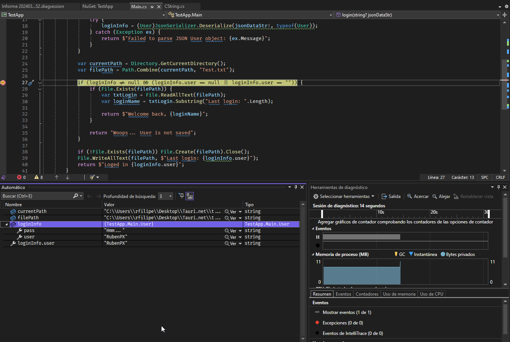

> [!warning]
> This project will be discontinued due tauri will support C# and other languagues in a future.
>
> For now, to make a minimal browser API you can use [webview/webview_csharp](https://github.com/webview/webview_csharp). Implements C# at backend can you can use any framework at forntend using NPM/PNPM/Yarn/etc...
>
> take a a look at this post https://v2.tauri.app/about/philosophy/#polyglots-not-silos

# Tauri.NET

This template should help get you started developing with [Tauri](https://tauri.app), [.NET](https://dotnet.microsoft.com/es-es/learn/dotnet/what-is-dotnet) and [Vite](https://vitejs.dev). 

## TODOS
- [X] Call C# code from Tauri
- [X] Call C# code from tauri with parameters and return string
- [X] Allow comunication betwen JSON data
- [ ] Call Tauri code from C#
- [ ] Hide exposed dlls to make a single exe ([Embed files](https://tauri.app/v1/guides/building/resources/))

## Debuging



You can debug .net dll [ataching VisualStudio to process](https://learn.microsoft.com/en-us/visualstudio/debugger/attach-to-running-processes-with-the-visual-studio-debugger) to loaded tauri app

## How it works


Comunication betwen framewowrks are transitive and it's defined using [Rust](https://www.rust-lang.org) code.

Rust manage comunication betwen frameworks

## Show me the code

You can replace frontend as you want

To invoke NetHost code, you need install [tauri API](https://www.npmjs.com/package/@tauri-apps/api) and run this code (It's an example)

> invocation in clientside
```javascript
import { TauriLib } from "./TauriComunication";

async function login(user: string): Promise<string | null> {
    let userData = {user: user, pass: "Hmm..."}

    try {
      return await TauriLib.invokePlugin<string>({ plugin: "TestApp", method: "login", data: userData });
    } catch (error) {
      return "ERR: " + error;
    }
}

let message = await login("RubenPX")
```

> invocation in backend
```C#
public static class Main {

   class User {
      public string user { get; set; }
      public string pass { get; set; }
   }

   [RouteMethod] // <-- This is required
   public static RouteResponse login(RouteRequest request, RouteResponse response) {
      User? loginInfo = null;

      if (request.data != null) {
          try {
              loginInfo = Utils.ParseObject<User>(request.data);
          } catch (Exception ex) {
              return response.Error($"Failed to parse JSON User object: {ex.Message}");
          }
      }

      if (loginInfo == null || loginInfo.user == "" || loginInfo.user == null) {
          return response.Error("Woops... User is empty");
      }

      return response.Ok($"Loged in {loginInfo.user}");
   }
}
```

## Working enviroment example

```yaml
[✔] Environment
    - OS: Windows 10.0.22631 X64
    ✔ WebView2: 122.0.2365.66
    ✔ rustc: 1.74.1 (a28077b28 2023-12-04)
    ✔ cargo: 1.74.1 (ecb9851af 2023-10-18)
    ✔ rustup: 1.26.0 (5af9b9484 2023-04-05)
    ✔ Rust toolchain: stable-x86_64-pc-windows-msvc (default)
    - node: 21.6.2
    - pnpm: 8.6.1
    - npm: 9.6.6

[-] Packages
    - tauri [RUST]: 1.6.1
    - tauri-build [RUST]: 1.5.1
    - wry [RUST]: 0.24.7
    - tao [RUST]: 0.16.7
    - @tauri-apps/api [NPM]: 1.5.3
    - @tauri-apps/cli [NPM]: 1.5.10

[-] App
    - build-type: bundle
    - CSP: unset
    - distDir: ../dist
    - devPath: http://localhost:1420/
    - bundler: Vite
```

Latest working build example: [Download](https://github.com/RubenPX/TauriNET/releases/download/0.1.4/TauriNET_example.zip)

## References
- [.NET](https://learn.microsoft.com/dotnet/core/introduction)
- [RustLang](https://www.rust-lang.org/es)
- [netcorehost by OpenByteDev](https://github.com/OpenByteDev/netcorehost)
- [Tauri](https://tauri.app)
- [JavaScript](https://developer.mozilla.org/es/docs/Web/JavaScript)
